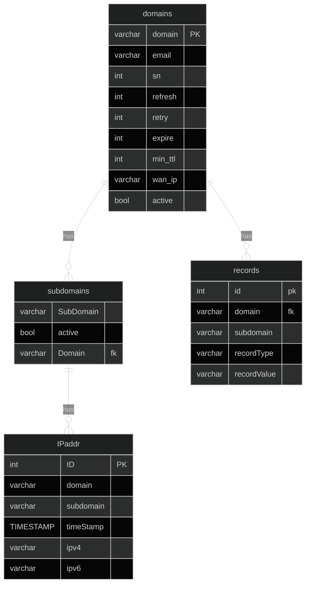

## Domains
This is where I store all the static lookup zone data.
## Subdomains
This is where I store subdomain data. This holds whether or not the subdomain is active (if the subdomain is added to the zone files) and deals with the many to many relationship of the IP data.
- This table uses the combination of sub-Domain and domain as its primary key

## IPaddr
This is where I track the changing IP addresses
- This table stores domain and sub-domain separately so its easier to query to/from subdomains 

## Records
This is where I mark A, NS, and other records. I don't expect to have many other record types here.